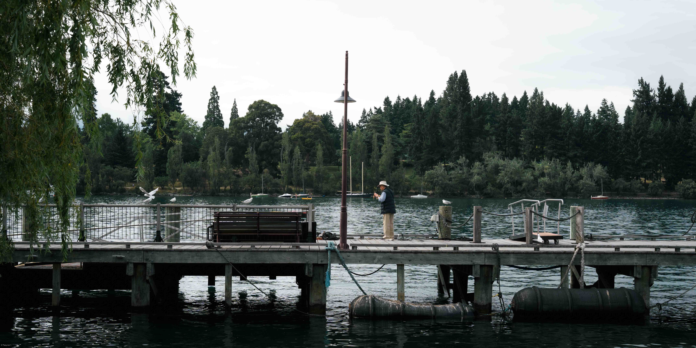

<h2 align="center">⟡ ⋆ ────────&emsp;<strong>𝐉𝐂 𝐋𝐈𝐍</strong>&emsp;──────── ⋆ ⟡</h1>

<h3 align="center">Electrical Engineering Student @ NTHU</h2>

  

  
    A quiet lakeside moment in Queenstown, New Zealand · 50mm · f/8 · 1/320s · ISO 160
  

## 📸 **About me** 
- Interested in <strong>artificial intelligence, computer vision, and computational photography</strong>.
- Currently exploring <strong>self-localization within floorplans</strong>.
- Passionate about <strong>photography</strong> and <strong>visual storytelling</strong>.
## 🔬 **Projects** 
- [Order Learning with Large Multimodal Models for Facial Beauty Prediction](https://github.com/ljc-1222/lmol-scut-fbp5500)
  
  A facial beauty prediction project that explores order learning and large multimodal models as pairwise comparators for more robust aesthetic score estimation.
  
- [Bokeh rendering & Focus stacking suite](https://github.com/ljc-1222/bokeh-rendering-focus-stacking-suite)
  
  A computational photography toolkit for simulating realistic bokeh and generating all-in-focus images through depth estimation, image alignment, and multi-scale fusion.

- [Marginal distortion correction](https://github.com/ljc-1222/marginal-distortion-correction) (Still in progress)
  
  A wide-angle image correction project that reduces marginal distortion by combining ROI-aware mesh warping, line preservation, and optimization-based geometric rectification.

  
- [Self-localization within a floorplan](https://github.com/ljc-1222/semrayloc-hohonet) (Still in progress)
  
  An indoor localization project that implements and evaluates floorplan-based camera pose estimation methods.
  

- [A2C2 Implementation on openpi-comet](https://github.com/ljc-1222/b1k) (Still in progress)
  
  Implementation of A2C2 correction head on openpi-comet model.
  
  

## 📓 **Corese Works**
- [EE341000 Algorithms](https://github.com/ljc-1222/EE341000-Algorithms)
- [EE366200 Digital Signal Processing Laboratory](https://github.com/ljc-1222/EE366200-Digital-Signal-Processing-Laboratory)
- [EE655000 Machine Learning](https://github.com/ljc-1222/EE655000-Machine-Learning)
- [EE662000 Computational Photography](https://github.com/ljc-1222/EE662000-Computational-Photography)
- [AIA500500 Deep Learning--NYCU](https://github.com/ljc-1222/AIA500500-Deep-Learning--NYCU)
  
